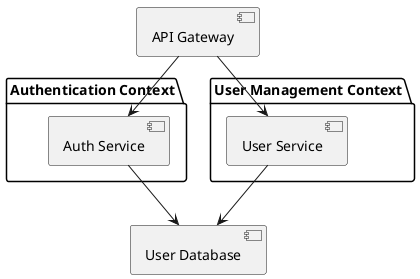
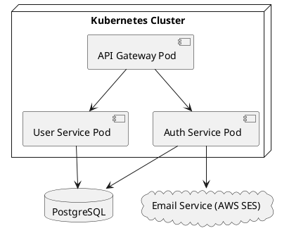
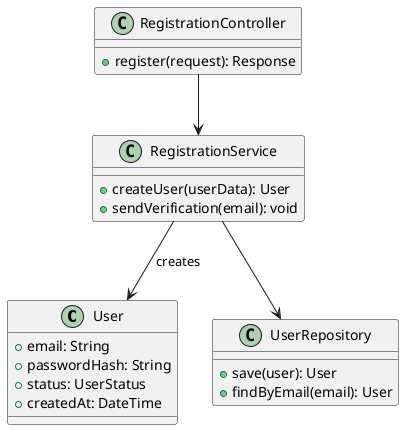
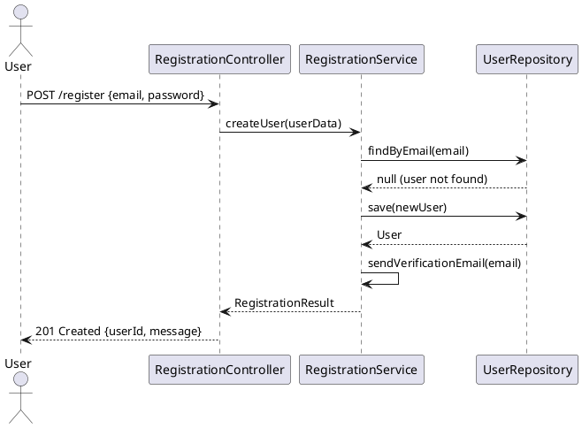
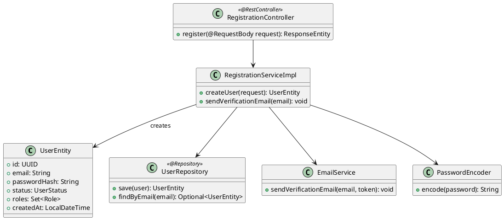
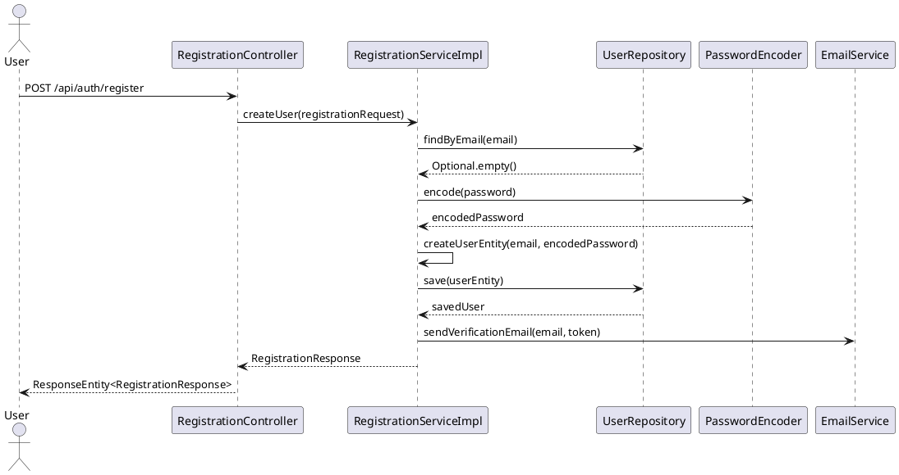

# End-to-End Artifacts: User Registration

_From Requirements to Implementation with Requirements, Logical & Physical Architecture, DDD & OOAD_

## 1. Requirements

### Functional Requirements

| ID   | Title             | Description                                                                                |
| ---- | ----------------- | ------------------------------------------------------------------------------------------ |
| FR-1 | User Registration | Users can register using email/password or Google SSO to create an account on the platform |

### Non-Functional Requirements

| ID    | Title       | Description                                                      |
| ----- | ----------- | ---------------------------------------------------------------- |
| NFR-3 | Performance | Registration API must respond within 2 seconds under normal load |
| NFR-5 | Data Safety | User data must be stored securely and comply with PDPA/GDPR      |

### Security Requirements

| ID   | Title            | Description                                                           |
| ---- | ---------------- | --------------------------------------------------------------------- |
| SR-1 | Secure Protocols | All authentication must use secure protocols (OAuth2/JWT, HTTPS)      |
| SR-3 | Data Protection  | Passwords and sensitive data must be encrypted at rest and in transit |

## 2. Use Case

### Use Case: User Registration

**Use Case Name:** User Registration  
**Actors:** User  
**Goal/Purpose:** Enable a new user to register on the Explore Singapore platform  
**Preconditions:** User is not already registered; Registration service is operational  
**Postconditions:** User account is created and pending verification

**Main Flow:**

1. User selects 'Register' and provides details (email/password or Google SSO)
2. System validates information format and uniqueness
3. System creates user record and assigns basic user role
4. System sends verification email (if email method)
5. System confirms successful registration to user

**Alternate Flows:**

- User provides invalid/missing data → System shows validation errors
- Email already exists → System shows "Email already registered"
- Google SSO fails → System shows error, allows retry

**Related Requirements:** FR-1, SR-1, SR-3, NFR-3, NFR-5

## 3. DDD (Domain-Driven Design)

### Bounded Context

**Authentication Context** - Handles user identity, registration, login, and access management

### Ubiquitous Language

- **Register:** Create a new user account
- **User:** Person using the platform
- **Verification:** Process to confirm email/identity
- **Credentials:** User's login information (email/password)

### Domain Model

**Aggregate Root:** User  
**Entities:** User, VerificationToken  
**Value Objects:** Email, Password, UserRole  
**Domain Events:** UserRegistered, EmailVerificationSent  
**Services:** RegistrationService, EmailVerificationService

### Domain Event

```
UserRegistered:
- UserId
- Email
- RegistrationTimestamp
- VerificationRequired
```

## 4. Logical Solution Architecture

### High-Level Services



### Service Responsibilities

- **Auth Service:** Handles registration, login, JWT token management
- **User Service:** Manages user profiles, roles, verification documents
- **API Gateway:** Routes requests, enforces authentication

## 5. Physical Solution Architecture

### Technology Mapping

- **Auth Service:** Java 17 + Spring Boot 3.x + Spring Security
- **User Service:** Python 3.11 + Django 4.x + Django REST Framework
- **Database:** PostgreSQL 15 (shared)
- **Infrastructure:** Kubernetes on AWS/GCP
- **Communication:** REST APIs, async messaging (RabbitMQ)

### Deployment Diagram



## 6. OOAD Analysis Diagrams (Platform-Independent)

### Analysis Class Diagram



### Analysis Sequence Diagram



## 7. OOAD Design Diagrams (Platform-Specific)

### Design Class Diagram



### Design Sequence Diagram



## 8. Changes from Analysis to Design

| Aspect            | Analysis                               | Design                               | Reason                      |
| ----------------- | -------------------------------------- | ------------------------------------ | --------------------------- |
| Classes           | Generic names (RegistrationController) | Framework-specific (@RestController) | Technology binding          |
| Password Handling | Basic password field                   | PasswordEncoder service              | Security requirement        |
| Email             | Simple sendVerification method         | Dedicated EmailService               | Separation of concerns      |
| Data Types        | Generic String types                   | UUID, LocalDateTime                  | Database/framework specific |
| Repositories      | Basic UserRepository                   | Spring Data @Repository              | Framework patterns          |
| Error Handling    | Basic result                           | Optional<> and ResponseEntity        | Framework conventions       |

## 9. BDD Scenarios (Gherkin)

```gherkin
Feature: User Registration

Scenario: Successful email registration
  Given a user wants to register with email "test@example.com"
  When they submit valid registration details
  Then a user account should be created
  And a verification email should be sent
  And they should receive a confirmation response

Scenario: Registration with existing email
  Given a user with email "existing@example.com" is already registered
  When they try to register with the same email
  Then registration should fail
  And they should see "Email already registered" message

Scenario: Google SSO registration
  Given a user wants to register using Google SSO
  When Google authentication is successful
  Then a user account should be created
  And they should be logged in immediately
```

## 10. Implementation Tasks (User Stories)

| Story | Description                     | Acceptance Criteria                                    |
| ----- | ------------------------------- | ------------------------------------------------------ |
| US-1  | Implement registration endpoint | API accepts email/password, returns 201 on success     |
| US-2  | Add email validation            | Valid email format required, duplicate emails rejected |
| US-3  | Implement password encryption   | Passwords hashed using bcrypt before storage           |
| US-4  | Add Google SSO integration      | Users can register/login via Google OAuth2             |
| US-5  | Implement email verification    | Verification emails sent, accounts activated on click  |
| US-6  | Add input validation            | All required fields validated, proper error messages   |
| US-7  | Write unit tests                | >90% code coverage for registration service            |
| US-8  | Write integration tests         | End-to-end registration flow tested                    |
